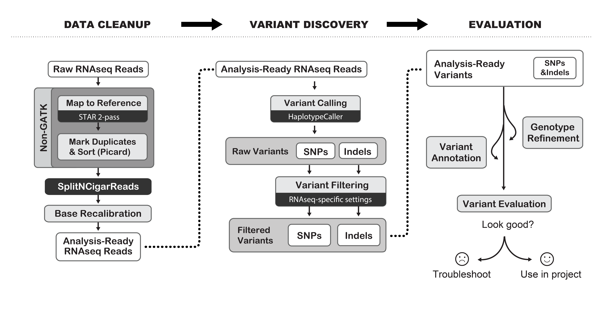
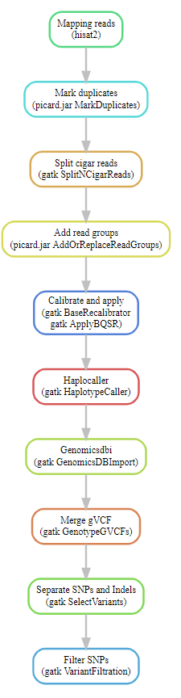

# RNAseq variant calling workflow
[](http://www.repostatus.org/#active) 

Introduction
------------

This small RNA variant calling pipeline provides a solution to process RNA sequencing data for RNAseq variant calling. The pipeline is built in Snakemake using GATK can be run on different platforms and high performance computing (HPC) systems. 


Installation
------------
To install this workflow, clone the repo:

```
git clone https://github.com/sinanugur/RNAseq-variant-calling.git
cd RNAseq-variant-calling

```

Quick start example
-------------------
You should create a new directory called __data__ and place your FASTQ files or their symbolic links into `data/` directory. This will trigger a workflow run immediately using 15 threads:

```
snakemake -j 15 --use-conda
```

Workflow summary and DAG plot
-----------------------------
We followed the GATK RNAseq short variant discovery pipeline. 


Our Snakemake DAG plot.



Funding
---------
The study was funded by the European Union’s Horizon 2020 research and innovation program (grant 825741). 


